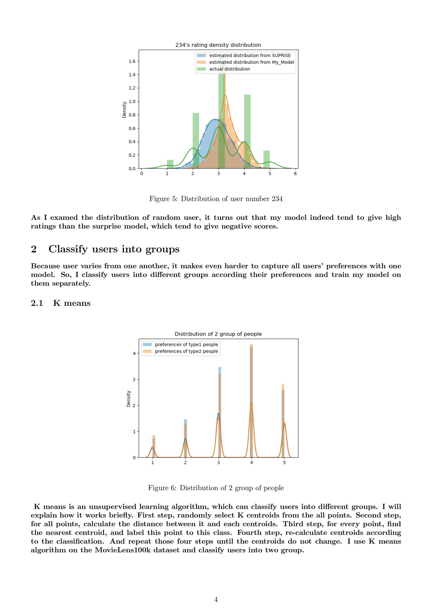

# Installation
    git clone https://github.com/Jas000n/NMF_sparse.git
# Usage
    cd NFM_sparse
    python NMF.py [-h] [-lr LR | -k K | -e E | -o O] train_matrix test_matrix
# Parameters
    positional arguments:
        train_matrix  input test matrix
        test_matrix   input test matrix

    optional arguments:
        -h, --help    show this help message and exit
        -lr LR        learning rate
        -k K          width of matrix1 and length of matrix2
        -e E          max iterations
        -o O          path of output files

